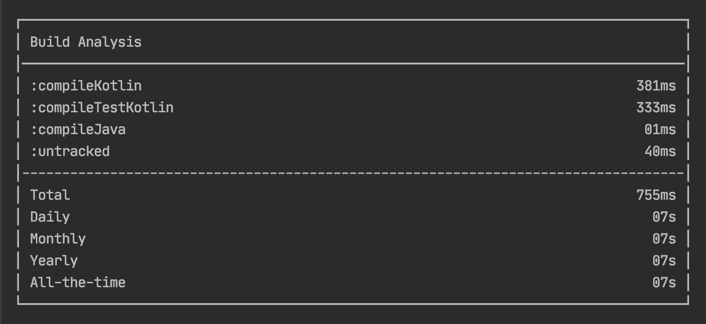

# Gradle Build Time Tracker: Want to know how much time you waste on IDEs for the building process?
[](https://github.com/janbarari/gradlebuildtimetracker)
[](https://github.com/janbarari/gradlebuildtimetracker)
[](https://github.com/janbarari/gradlebuildtimetracker)

A lightweight console tool that shows you how much time you spent at the Gradle build process. Simple analytics tells you time spent for the day, month, year, and also you can export it as a CSV file. no need to write any command. It will show you after your build is finished.  



## Setup
```kotlin
plugins {
    id("com.github.janbarari.gradlebuildtimetracker") version "1.0.0"
}
```
## or use legacy ⬇️
```kotlin
buildscript {
  repositories {
    maven {
      url = uri("https://plugins.gradle.org/m2/")
    }
  }
  dependencies {
    classpath("com.github.janbarari:GradleBuildTimeTracker:1.0.0")
  }
}

apply(plugin = "com.github.janbarari.gradlebuildtimetracker")
```

## Sponsor
  ### If you like and use it, please tap the Star(⭐️) button at the above.  
  This source code is free for all; hence, it's not profitable. You can make me happy by donating me :)
  
  [](https://blockchair.com/dogecoin/address/DB87foUxetrQRpAbWkrhexZeVtnzwyqhSL)
  
  [](https://blockchair.com/bitcoin/address/bc1qj30t3hmw0gat3vmwye972ce4sfrc5r5mz0ctr6)
  
## License

    Copyright 2021 Mehdi Janbarari

    Licensed under the Apache License, Version 2.0 (the "License");
    you may not use this file except in compliance with the License.
    You may obtain a copy of the License at

       http://www.apache.org/licenses/LICENSE-2.0

    Unless required by applicable law or agreed to in writing, software
    distributed under the License is distributed on an "AS IS" BASIS,
    WITHOUT WARRANTIES OR CONDITIONS OF ANY KIND, either express or implied.
    See the License for the specific language governing permissions and
    limitations under the License.
